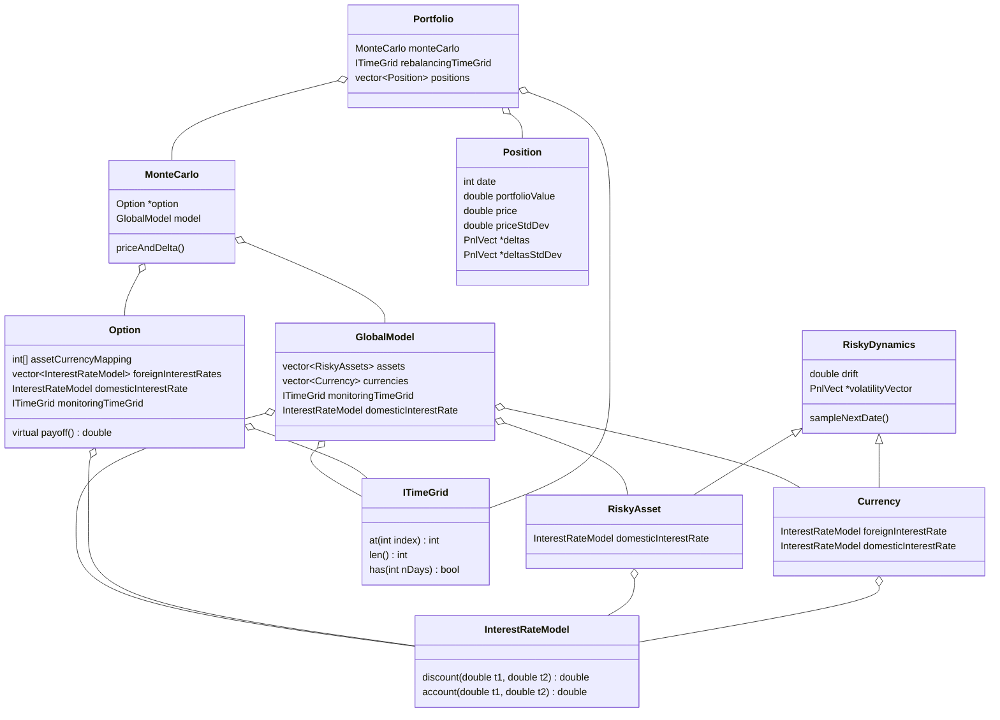

# Architecture

Suggestion d'architecture

```mermaid
classDiagram


GlobalModel o-- RiskyAsset
GlobalModel o-- Currency
GlobalModel o-- ITimeGrid
GlobalModel o-- InterestRateModel
GlobalModel : vector~RiskyAssets~ assets
GlobalModel : vector~Currency~ currencies
GlobalModel :  ITimeGrid monitoringTimeGrid
GlobalModel : InterestRateModel domesticInterestRate

MonteCarlo o-- Option
MonteCarlo o-- GlobalModel
MonteCarlo : Option *option
MonteCarlo : GlobalModel model
MonteCarlo : priceAndDelta()

Option o-- ITimeGrid
Option o-- InterestRateModel
Option : int[] assetCurrencyMapping
Option : vector~InterestRateModel~ foreignInterestRates
Option : InterestRateModel domesticInterestRate
Option :  ITimeGrid monitoringTimeGrid
Option : virtual payoff() double


RiskyAsset o-- InterestRateModel
RiskyAsset : InterestRateModel domesticInterestRate

Currency o-- InterestRateModel
Currency : InterestRateModel foreignInterestRate
Currency : InterestRateModel domesticInterestRate

RiskyDynamics <|-- RiskyAsset
RiskyDynamics <|-- Currency
RiskyDynamics : double drift
RiskyDynamics : PnlVect *volatilityVector
RiskyDynamics : sampleNextDate()

Portfolio o-- Position
Portfolio o-- MonteCarlo
Portfolio o-- ITimeGrid
Portfolio : MonteCarlo monteCarlo
Portfolio : ITimeGrid rebalancingTimeGrid
Portfolio : vector~Position~ positions

class Position {
  int date
  double portfolioValue
  double price
  double priceStdDev
  PnlVect *deltas
  PnlVect *deltasStdDev
}

class ITimeGrid {
  at(int index) int
  len() int
  has(int nDays) bool
}

class InterestRateModel {
  discount(double t1, double t2) double
  account(double t1, double t2) double
}

```
